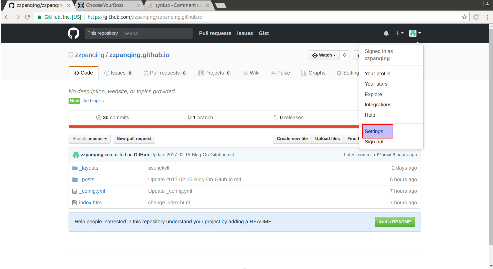

# push 到 github 不用输入用户名，密码

环境 ubuntu 16.04

分三步：
* 生成你的公钥私钥

    $ cd ~/.ssh
    $ ssh-keygen -t rsa -C "your_mail_adress_used_github@xxx.com"

公钥私钥被生成分别是 id_rsa.pub 和 id_rsa

* 添加 id_rsa.pub 到 github 你的账户中, 在 account setting 中找

* 测试

    $ ssh -T git@github.com 

* 将github 上你的 repository 设为使用 ssh url 
![repository_url_http_ssh] (../images/github_repository_use_ssh.png )
点击 use ssh 会出现 ssh 形式的 url 拷贝到本地的 git config 文件。

* 修改你本地机器上的 repository/.git/config
[remote "origin"]
	url = git@github.com:zzpanqing/zzpanqing.github.io.git 
url = 后面的内容是上一步从得到的

